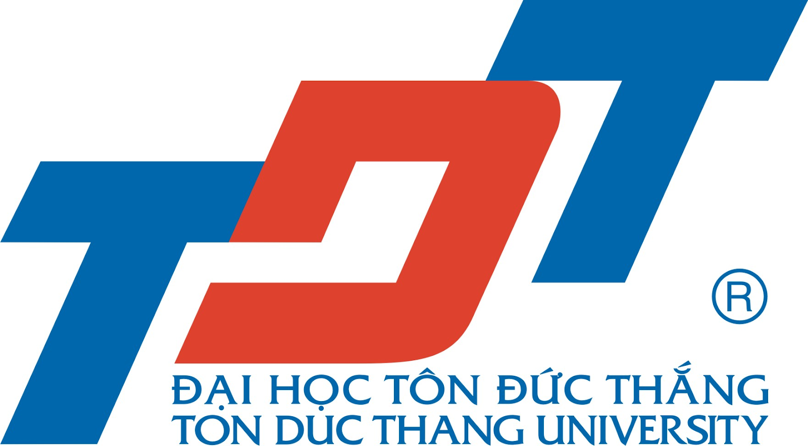
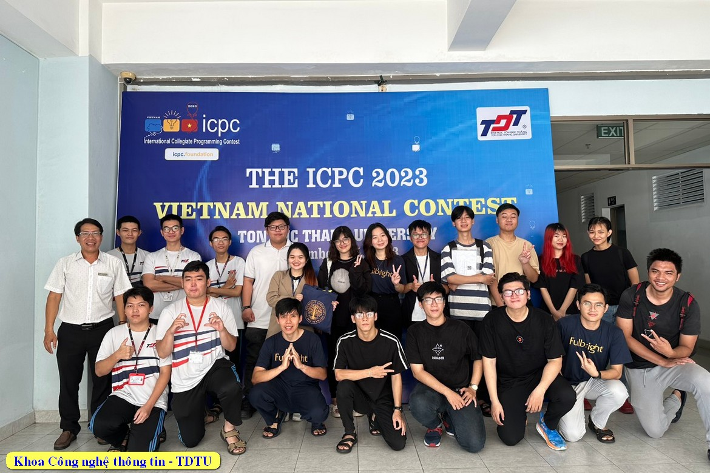

# 👨‍🏫 Lecturer Website



---

## 🌟 Giới Thiệu

**Lecturer_Website** là trang web cá nhân dành cho giảng viên [Doãn Xuân Thanh](mailto:dzoanxuanthanh@tdtu.edu.vn), trường Đại học Tôn Đức Thắng, giúp kết nối sinh viên, đăng tải tin tức, sự kiện, tài liệu học tập và công cụ quản lý lớp học hiện đại.

- 🖥️ **Công nghệ**: HTML5, CSS3, Bootstrap 5
- 👤 **Giảng viên**: ThS. Doãn Xuân Thanh  
  - Nghề nghiệp: Giảng viên Khoa Công nghệ Thông tin  
  - Email: dzoanxuanthanh@tdtu.edu.vn  
  - Phòng làm việc: C119
- 🏫 Trường: Đại học Tôn Đức Thắng (TDTU)
- 🌍 Địa chỉ: Quận 7, TP. Hồ Chí Minh, Việt Nam

---

## 🗂️ Chức Năng Nổi Bật

### 📰 Tin Tức & Sự Kiện
- Cập nhật thông báo mới nhất, hoạt động nổi bật của trường, khoa và thị trường việc làm IT.

### 📚 Tài Liệu Học Tập
- Tổ chức tài liệu theo từng mảng: CSS, HTML, Java, Python,...  
- Mỗi môn có hình minh họa và nội dung mô tả chi tiết.

### ⏰ Quản Lý Điểm Danh
- Chức năng điểm danh sinh viên: Có mặt, Vắng, Trễ bằng nút bấm rõ ràng, giao diện trực quan.

### 💼 Góc Việc Làm
- Tổng hợp thông tin tuyển dụng, thực tập: FPT Software, TGDD, Netlogic, FLOG...
- Phù hợp cho sinh viên năm cuối, các vị trí theo ngôn ngữ: Java, ReactJS, Flutter, Swift, ...

### 📞 Liên Hệ & Hỗ Trợ
- Form liên hệ nhanh (Họ tên, email, phone, nội dung)
- Tích hợp bản đồ Google Maps
- Liên kết mạng xã hội:  
  [](https://www.facebook.com/gnol24112k/)
  [](https://www.instagram.com/__thanhlong_2411/)
  [](https://github.com/thanhlong2411/)

---

## 🏗️ Cấu Trúc Thư Mục

```
Lecturer_Website/
├── ad/
├── admin/
├── anh/                # Hình ảnh (logo, banner, giáo viên, sự kiện)
├── css/                # File CSS
├── sql/                # SQL scripts, cấu hình cơ sở dữ liệu
├── tlieu/              # Tài liệu chi tiết các môn lập trình
├── vendor/             # Thư viện ngoài
├── index.html          # Trang chủ (carousel, sứ mệnh, mục tiêu, hình hoạt động)
├── gioi_thieu.html     # Mô tả cá nhân giảng viên, thành tựu, thông tin liên hệ
├── thong_bao.html      # Tin tức, sự kiện nổi bật
├── diem_danh.html      # Trang điểm danh sinh viên
├── lien_he.html        # Trang liên hệ (form + bản đồ)
├── viec_lam.html       # Thông tin tuyển dụng, việc làm IT
├── tai_lieu.html       # Tổng hợp tài liệu học tập
├── tin.html            # Tin ngắn, hoạt động
├── gk.html             # Redirect về trang chủ
├── logout.html         # Form đăng xuất (script xóa session/logout user)
└── ...
```

---

## 🚀 Khởi Động Dự Án

1. **Yêu cầu**: Web server cơ bản (Apache/Nginx) hoặc mở qua Live Server extension (VSCode)
2. **Cài đặt**:  
   - Clone repo:  
     ```bash
     git clone https://github.com/Szero-White/Lecturer_Website.git
     ```
   - Mở `Lecturer_Website/index.html` bằng trình duyệt.

---

## 📸 Một Số Hình Ảnh Trang Web




---

## ✨ Đóng Góp & Liên Hệ

- 📨 Email phản hồi/báo lỗi: dzoanxuanthanh@tdtu.edu.vn
- 📬 Facebook: [Doãn Xuân Thanh](https://www.facebook.com/gnol24112k/)
- 🌐 Instagram: [xuanthanh_tdtu](https://www.instagram.com/__thanhlong_2411/)
- 💼 GitHub cá nhân: [Szero-White](https://github.com/Szero-White)

<br/>

<p align="center">
  
  
</p>

---

> Website phục vụ quản lý, giao tiếp, chia sẻ thông tin học tập cho sinh viên Đại học Tôn Đức Thắng.
